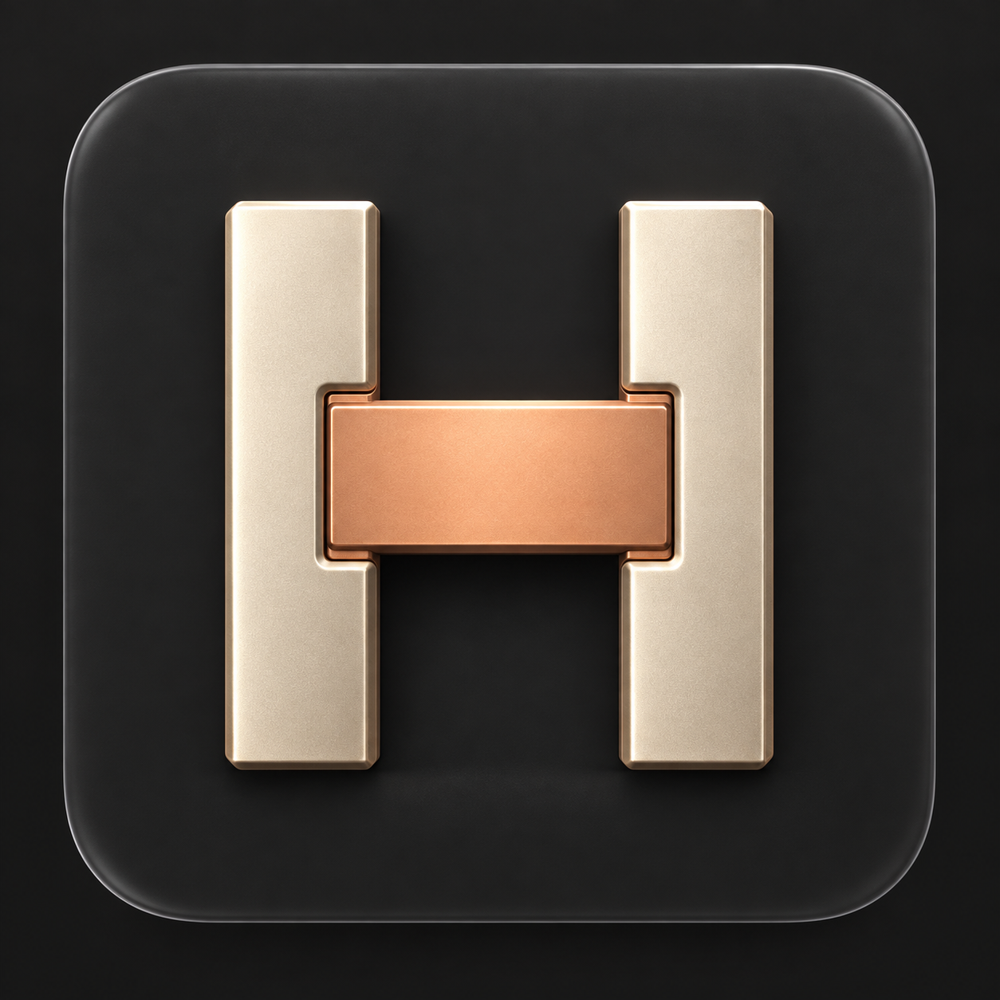

<p></p>

# Hyper Agentic Engineering

Portable memory, lean context, and reliable handoffs for coding agents.

**Public alpha · engineering first · Python 3.11+ · no runtime dependencies.**

HAE adds continuity to an existing Claude Code, Codex or Copilot setup. It preserves current instructions and hooks, keeps readable Markdown memory under your control, and records what another agent needs to resume. Obsidian is an optional viewer. An optional general-work mode uses project folders and deliverables without coding requirements.

Engineering setup includes [generalized working practices and task routing](docs/engineering.md): assumptions, simple focused changes, debugging, verification, review and team handoffs. Optional installed skills are selected by task rather than loaded as a whole library. See [native Windows setup](docs/windows.md) for PowerShell commands; macOS/Linux use the commands below.

## Give this to your agent

Open Claude Code, Codex or Copilot in the project you want to work on, then paste:

```text
Set up Hyper Agentic Engineering for this project. Read and follow
https://github.com/niomartinez/hyper-agentic-engineering/blob/v0.1.0-alpha.3/SETUP.md
Use the pinned release, inspect my existing setup, and preserve my instructions,
hooks and memories. Use engineering mode unless I ask for general work.
Show a concise plan, carry out the setup I have authorized, and verify save,
recall and recovery. Ask only for consequential choices you cannot establish.
Keep providers and automatic capture off unless I choose them.
```

**Your agent does the installation.** You do not need to run the commands below or read the technical guides. It needs terminal and file access, Python 3.11+, and access to the project. If a prerequisite or native trust action needs your input, it should tell you exactly what is missing. Browser-only chats cannot install local files.

Engineering is the default. Add “Use general-work mode” for research, operations or other project work. Obsidian is optional. Cowork packages are experimental; real sandbox install/resume is not yet verified.

The agent checks existing memory tools before choosing one authority. It never migrates, disables or deletes your existing memory automatically. Existing styles stay in place; lean responses and small-change practices are available with `--style lean`.

Manual setup, upgrades and removal: [technical guide](docs/setup.md). Native Windows: [PowerShell guide](docs/windows.md). Packaged runtime and plugins: [alpha release](https://github.com/niomartinez/hyper-agentic-engineering/releases/tag/v0.1.0-alpha.3).

## What happens during work

1. Resolve the current project once. Retrieve only relevant notes.
2. The main conversation interprets a remember/override request or milestone.
3. Local code writes a small approved packet and returns a receipt. No second language model is needed.
4. At a cutoff or handoff, save verified results and the next unfinished step.
5. Another session uses the same folder; another person receives a sanitized project handoff.

Ordinary replies do not need curated notes. Account changes do not establish authorship or change the selected vault. Historical captures never become permission or current truth.

## Optional capabilities

| Option | Behavior |
| --- | --- |
| `--hooks` during setup | Bounded final-response evidence from supported hosts; transcripts are never read |
| `--style lean` | Concise replies and small complete changes; existing style stays the default |
| `--mode general` | Project preferences, decisions, sources, deliverables and handoffs |
| Jev | Experimental BYOK selection/ranking, explicit scopes and spending limits; off by default |
| Backups | Explicit text-only local archive; existing private Git workflow can be used after review |
| Upstream skills | Pinned source catalog with licensing notes; no automatic installation or bundled upstream code |

Codex hooks require native trust review. Copilot parent stop events may contain only metadata, so direct checkpoints remain necessary. There is no background generative janitor, transcript importer, dashboard or model override.

## Commands

```text
plan / apply      Preview and apply reviewed configuration changes
context           Resolve a mapped project or report unresolved scope
memory save       Persist approved prose, with idempotent receipts
memory recall     Bounded local search and optional Jev ranking
memory health     Report missing notes, pending captures and aging review dates
memory status     Show local provider usage and capture state
memory backend    Explicitly enable Jev or return to local-only mode
handoff           Write an approved brief inside the mapped project
backup            Create an explicit text-only local archive
catalog           Inspect optional upstream sources
skills route      Select a relevant installed skill, with a local workflow fallback
rollback          Reverse the latest setup transaction, preserving memory
uninstall         Remove owned integrations, preserving memory and later edits
```

`--home` and `--state-dir` allow disposable profiles. They are global options and go before the command. Setup uses the selected profile's standard agent folders; it does not alter `CODEX_HOME`, `CLAUDE_CONFIG_DIR` or `COPILOT_HOME`. Custom agent home layouts need explicit validation before use.

## Build and verify

```sh
python3 -m unittest discover -s tests -v
python3 tools/build_plugins.py
python3 tools/benchmark.py
```

Generated self-contained skills and per-host plugins are under `dist/`. Source skill folders are authoring inputs; use generated packages when distributing a skill alone. Do not copy only `SKILL.md` and assume the runtime exists.

Read [setup and recovery](docs/setup.md), [memory and privacy](docs/memory.md), [compatibility and evidence](docs/compatibility.md), [upstream licenses](docs/upstreams.md), and [release status](RELEASE-STATUS.md).

The 71-test suite passed on native Windows, macOS and Linux with Python 3.11 and 3.12. Generated command execution, install/upgrade/removal, Unicode memory and scope isolation are covered. All six jobs also passed the 1,000-note recall benchmark with zero provider calls and no irrelevant metadata matches. See [measured evidence](docs/evidence/README.md) for latency results and limits. Live authenticated host acceptance, Cowork support and independent adoption remain unverified; this is an early evaluation release. See [security boundaries](SECURITY.md).
